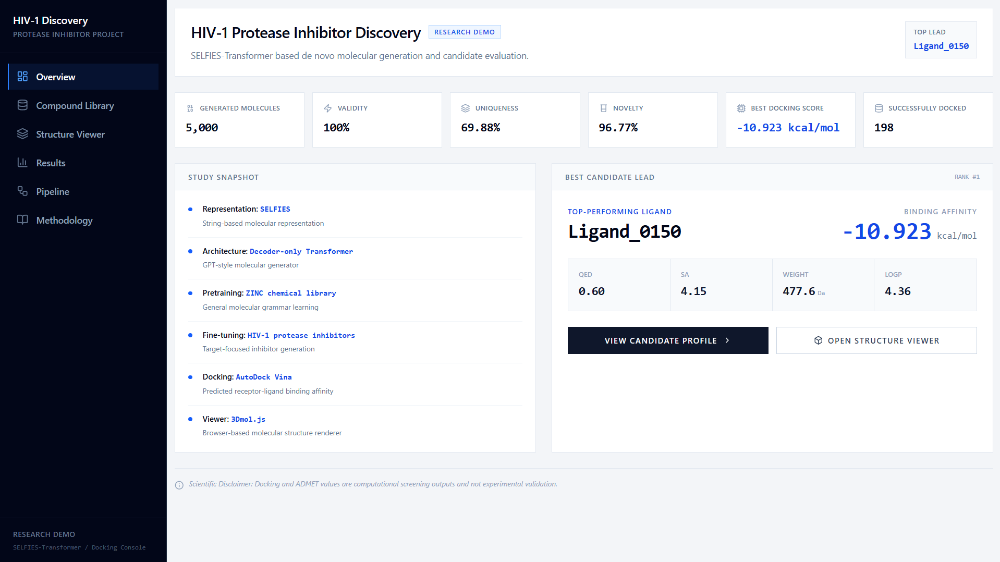
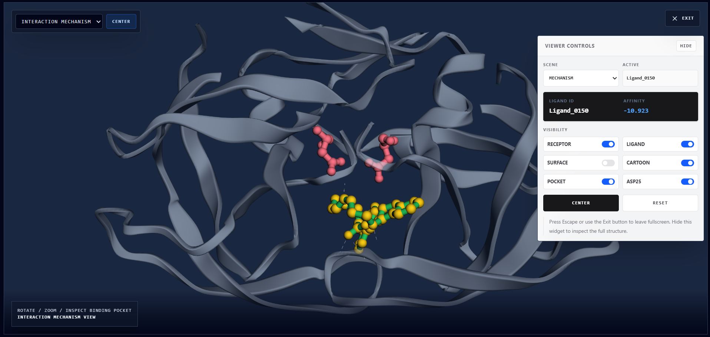

# AI-Driven HIV-1 Protease Inhibitor Discovery using SELFIES-Transformer

This repository contains an end-to-end computational drug discovery pipeline for de novo HIV-1 protease inhibitor generation. The workflow combines SELFIES molecular representation with a decoder-only Transformer, followed by RDKit-based medicinal chemistry filtering, diversity selection, AutoDock Vina docking, and candidate analysis.

> **Research status:** These are computationally predicted candidates. They are not experimentally validated therapeutics.


## Preview





## Live Research Demo

https://proteaseai.xyz

## Demo Video

https://drive.google.com/file/d/1Fm2iHS0_7U7_MH2pOXOZQb6jW4pwRs0U/view?usp=sharing 

## Highlights

| Metric | Value |
|---|---:|
| Generated molecules | 5,000 |
| Chemical validity | 100% |
| Unique molecules | 3,494 / 5,000 |
| Uniqueness | 69.88% |
| Novelty vs. fine-tuning set | 96.77% |
| Final diverse docking set | 200 |
| Successfully docked | 198 |
| Best candidate | Ligand_0150 |
| Best Vina affinity | -10.923 kcal/mol |

## Pipeline

```text
ZINC + ChEMBL + PDB 1HVR
        ↓
SMILES cleaning and canonicalization
        ↓
SELFIES conversion and tokenization
        ↓
Decoder-only Transformer pretraining on ZINC
        ↓
Fine-tuning on HIV-1 protease inhibitors
        ↓
Molecule generation and RDKit validation
        ↓
Drug-likeness + PAINS/Brenk filtering
        ↓
Morgan fingerprint + Butina diversity selection
        ↓
AutoDock Vina docking against HIV-1 protease
        ↓
Ranked candidates, docking poses, and ADMET-style analysis
```

## Repository structure

```text
notebooks/                  Original and cleaned notebook references
scripts/                    Stage-wise scripts extracted/adapted from the Kaggle notebook
scripts/original_notebook_cells/  Raw extracted notebook cells for traceability
src/hiv_protease_pipeline/  Reusable helper modules
models/checkpoints/         Trained checkpoints and vocabulary (Git LFS recommended)
data/processed/             Cleaned processed datasets from the Kaggle run
results/candidates/         Generated molecules, filtered candidates, top-200 set
results/docking/            Vina scores, receptor/ligand files, poses, PyMOL scripts
results/figures/            Docking and visualization figures
assets/                     README/post/demo visual assets
docs/                       Project report PDF
```

## Installation

Conda is recommended because RDKit, Open Babel, and Vina can be platform-sensitive.

```bash
conda env create -f environment.yml
conda activate hiv-protease-selfies
```

If using pip only:

```bash
pip install -r requirements.txt
```

## Quick result check

This does not rerun training or docking. It only summarizes the included result files.

```bash
python scripts/quick_result_summary.py
```

## Full pipeline scripts

The full workflow is computationally heavy. Pretraining/fine-tuning require GPU time, and docking the final candidate set can take significant CPU time.

```bash
python scripts/01_pretrain_zinc.py
python scripts/02_prepare_hiv_chembl.py
python scripts/03_finetune_hiv.py
python scripts/04_generate_candidates.py
python scripts/05_novelty_and_scaffold_analysis.py
python scripts/06_pains_brenk_filter.py
python scripts/07_diversity_selection_and_sdf.py
python scripts/08_prepare_docking_inputs.py
python scripts/09_run_vina_docking.py
python scripts/10_analyze_results.py
```

## Traceability

- `notebooks/original_kaggle_reference.ipynb` is the original working Kaggle notebook.
- `scripts/original_notebook_cells/` contains the extracted original code cells for auditability.
- `scripts/` contains the stage-wise script version for a cleaner GitHub workflow.

## Disclaimer

This repository is for computational research and educational demonstration only. Predicted docking scores and ADMET-like profiles do not establish clinical efficacy, safety, or therapeutic activity.
